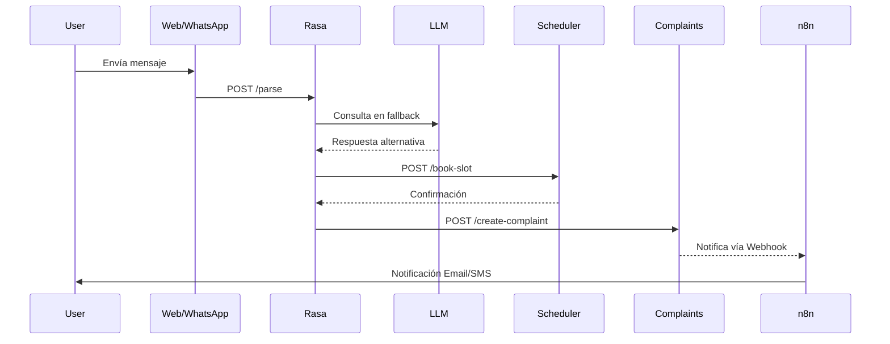

# Propuesta Integral para la Dockerización y Arquitectura del Demo Munbot

## Introducción

Munbot es un demo orientado a potenciales clientes, que actualmente integra funcionalidades de chatbot (basado en Rasa), gestión de reclamos y horarios, interacción vía WhatsApp (evolution.api) y asistencia conversacional mediante un LLM (con llama.cpp). La estructura actual, monolítica y con dependencias cruzadas, genera conflictos de versiones y acoplamientos difíciles de escalar. La propuesta aquí presentada tiene como objetivo:

- Desacoplar las funcionalidades en microservicios independientes.
- Facilitar la gestión de dependencias y mejorar el mantenimiento.
- Permitir un despliegue inicial local (MacBook Air 2018) y una futura migración a máquinas virtuales o entornos cloud.

---

# Análisis Crítico de la Estructura Actual

## Problemas Detectados

- **Dependencias Frágiles:**La coexistencia de módulos como llama.cpp, Rasa 3.x, Evolution API y n8n en un solo entorno genera conflictos (por ejemplo, versiones de Python, CUDA, librerías como transformers).
- **Acoplamiento Riesgoso:**Las acciones en _actions.py_ de Rasa gestionan lógica de negocio (horas, reclamos), manejo de datos en JSON y comunicación externa, lo que dificulta el escalado y la reutilización.
- **Falta de Aislamiento:**
  Servicios críticos (LLM, Evolution API) comparten recursos con el core de Rasa, aumentando latencias y el riesgo de colapso ante cargas elevadas.

Esta evaluación justifica la necesidad de una reestructuración que promueva el aislamiento, la escalabilidad y la facilidad de despliegue.

---

# Arquitectura Propuesta de Microservicios

La propuesta consiste en dividir la aplicación en varios contenedores, cada uno especializado en una función concreta y con APIs REST/WebSocket para la comunicación interna. Se sugiere la siguiente división:

Munbot es un demo orientado a potenciales clientes que integra funcionalidades de:

- **Chatbot con Rasa:** Procesa lenguaje natural (NLU), gestiona diálogos y orquesta interacciones.
- **Gestión de Reclamos y Horas de Atención:** Permite a los usuarios agendar citas y registrar reclamos.
- **Interfaz de Comunicación:** Proporciona canales de interacción vía web (React + Socket.io) y WhatsApp (Evolution API).
- **Asistencia Conversacional con LLM:** Responde consultas complejas cuando el chatbot falla en cubrirlas, utilizando llama.cpp.
- **Automatización de Flujos:** Utiliza n8n para coordinar procesos y notificaciones.

La arquitectura actual presenta problemas de acoplamiento y conflictos de dependencias. Esta propuesta tiene como objetivo abordar estos desafíos a través de la dockerización y la separación en microservicios.

---

# Visión General de la Arquitectura

La arquitectura propuesta se basa en la división del sistema en contenedores independientes, cada uno encargado de una funcionalidad específica. Los microservicios se comunican mediante APIs REST y WebSocket, y se orquestan a través de Docker Compose (con posibilidad de migrar a Kubernetes en el futuro).

## Componentes Principales

- **Rasa Core:**

  - **Tecnología:** Rasa 3.6 + FastAPI
  - **Responsabilidad:** Procesar NLU, gestionar diálogos y delegar acciones.
  - **Observación:** Se desacoplarán las acciones personalizadas en servicios externos.
- **LLM Gateway:**

  - **Tecnología:** FastAPI y llama.cpp
  - **Responsabilidad:** Atender consultas complejas y fallback para el chatbot.
  - **Observación:** Se empleará un modelo cuantizado (GGUF) y se limitará el contexto para optimizar recursos.
- **Scheduler Service:**

  - **Tecnología:** Python + SQLite o PostgreSQL
  - **Responsabilidad:** Gestión de citas y notificaciones.
  - **Observación:** Migrar de JSON a una base de datos relacional y realizar backups automáticos.
- **Complaints API:**

  - **Tecnología:** Node.js + MongoDB
  - **Responsabilidad:** Registro y seguimiento de reclamos.
  - **Observación:** Uso de Webhooks para notificar a otros servicios y generar identificadores únicos.
- **Evolution API:**

  - **Tecnología:** Node.js + WebSocket
  - **Responsabilidad:** Interfaz para comunicación vía WhatsApp.
  - **Observación:** Aislar en un contenedor, utilizando Redis para gestionar sesiones.
- **n8n Automations:**

  - **Tecnología:** n8n + RabbitMQ
  - **Responsabilidad:** Automatización de flujos de trabajo y coordinación entre servicios.
  - **Observación:** Emplear colas de mensajes para la gestión asíncrona.
- **Web Interface:**

  - **Tecnología:** React + Socket.io
  - **Responsabilidad:** Frontend para chat web y dashboard administrativo.
  - **Observación:** Servido a través de Nginx para SSL, con estructura separada en directorios `static` y `templates`.
- **Data Lake:**

  - **Tecnología:** MinIO y PostgreSQL
  - **Responsabilidad:** Almacenamiento de datos estáticos (JSON) y transaccionales críticos.
  - **Observación:** Uso de versionado en MinIO y respaldo de datos en PostgreSQL.

## Servicios Críticos

| **Microservicio**     | **Tecnología**          | **Responsabilidad**                                                               | **Observaciones**                                                                        |
| --------------------------- | ------------------------------ | --------------------------------------------------------------------------------------- | ---------------------------------------------------------------------------------------------- |
| **Rasa Core**         | Rasa 3.6 + FastAPI             | Procesar NLU, gestionar diálogos y orquestar las interacciones.                        | Desacoplar las acciones personalizadas a servicios externos. Usar REST para comunicación.     |
| **LLM Gateway**       | FastAPI + llama.cpp            | Responder a consultas complejas o fallbacks que el chatbot no cubra.                    | Utilizar modelo cuantizado (GGUF) y limitar el contexto para optimizar recursos.               |
| **Scheduler Service** | Python + SQLite (o PostgreSQL) | Gestión de horas de atención y notificaciones.                                        | Migrar de archivos JSON a una base de datos relacional; integrar backup diario (S3/MinIO).     |
| **Complaints API**    | Node.js + MongoDB              | Registro y seguimiento de reclamos.                                                     | Generar identificadores únicos y notificar a otros servicios mediante Webhooks.               |
| **Evolution API**     | Node.js + WebSocket            | Interfaz para WhatsApp.                                                                 | Aislar en contenedor; utilizar Redis para gestión de sesiones y validar IPs con lista blanca. |
| **n8n Automations**   | n8n + RabbitMQ                 | Automatización de flujos cruzados (por ejemplo, notificaciones, correos).              | Emplear colas de mensajes para acciones asíncronas y evitar cuellos de botella.               |
| **Web Interface**     | React + Socket.io              | Chat web y dashboard administrativo.                                                    | Servir a través de Nginx para SSL; separar frontend y backend para mayor independencia.       |
| **Data Lake**         | MinIO + PostgreSQL             | Almacenamiento de datos estáticos (JSON) y transaccionales críticos (horas/reclamos). | Migrar datos a MinIO con versionado y usar PostgreSQL para operaciones críticas.              |

## Comunicación entre Servicios

La interacción entre servicios se puede visualizar en un diagrama de secuencia (en lenguaje Mermaid, por ejemplo):



---

# Estrategia de Dockerización y Estructura de Directorios

## Estructura de Carpetas Sugerida

La transformación del proyecto se realizará mediante la creación de contenedores Docker para cada microservicio, lo que permitirá:

Aislamiento de Dependencias: Cada servicio utiliza su propia imagen y entorno, eliminando conflictos.
Desarrollo Modular: Facilita la actualización, escalabilidad y mantenimiento individual.
Orquestación Centralizada: Se utilizará Docker Compose para definir redes, volúmenes y variables de entorno, permitiendo una integración fluida.

La siguiente estructura modular separa cada microservicio en un directorio propio:

```graphql
munbot-docker/
├── docker-compose.yml          ## Orquestación de todos los servicios y redes.
├── README.md                   ## Guía de despliegue y documentación inicial.
├── docs/                       ## Documentación de arquitectura y configuraciones.
│   ├── architecture.md         ## Descripción general de la arquitectura.
│   └── folder_structure.md     ## Detalle de la organización de carpetas.
├── config/                     ## Configuraciones globales, certificados, etc.
│   └── .env                    ## Variables de entorno compartidas.
├── nginx/                      ## (Opcional) Configuración para reverse proxy.
│   ├── Dockerfile
│   └── nginx.conf
├── rasa-core/                  ## Servicio principal de chatbot con Rasa.
│   ├── Dockerfile              ## Imagen basada en Python 3.10, Rasa 3.6.
│   ├── requirements.txt        ## Dependencias (incluyendo transformers).
│   ├── config.yml              ## Configuración de Rasa.
│   ├── credentials.yml         ## Endpoints de canales (WebSocket, REST).
│   ├── domain.yml              ## Modelo de dominio de Rasa.
│   ├── data/                   ## Datos de entrenamiento (nlu, stories, rules).
│   └── actions/                ## Código para acciones personalizadas.
│   │   ├── __init__.py 
│       └── actions.py
├── llm-gateway/                ## Servicio para consultas del LLM.
│   ├── Dockerfile              ## Imagen con Ubuntu, llama.cpp, FastAPI.
│   ├── requirements.txt        ## Dependencias para FastAPI y llama.cpp.
│   └── app.py                  ## API para consulta al modelo.
├── scheduler/                  ## Servicio para la gestión de horas y notificaciones.
│   ├── Dockerfile              ## Imagen de Python (3.9 o 3.10) + SQLAlchemy.
│   ├── requirements.txt
│   ├── app.py                  ## API REST para agendar horas.
│   └── alembic/                ## Migraciones y scripts de DB.
├── complaints-api/             ## Servicio para el registro de reclamos.
│   ├── Dockerfile              ## Imagen basada en Node.js.
│   ├── package.json
│   └── app.js                  ## API para la gestión de reclamos.
├── evolution-api/              ## Interfaz para WhatsApp vía WebSocket.
│   ├── Dockerfile              ## Imagen basada en Node.js.
│   ├── package.json
│   └── app.js
├── n8n/                        ## Orquestador de flujos automatizados.
│   ├── Dockerfile              ## Personalizado o se utiliza la imagen oficial.
│   └── .env                    ## Configuración específica para n8n.
├── web-interface/              ## Frontend en React y Socket.io.
│   ├── Dockerfile
│   ├── package.json
│   ├── static/               
│   │   ├── css/
│   │   │   └── style.css
│   │   ├── images/             ## Directorio de las imágenes que usa la web
│   │   ├── js/
│   │   │   └── script.js       ## Directorio de las tipología de letras utilizadas por la web   
│   │   └── webfonts/
│   └── templates/
│   │   └── index.html
└── data-lake/                  ## Almacenamiento de datos estáticos y transaccionales.
    ├── Dockerfile              ## Para MinIO o configuración de PostgreSQL.
    └── init.sql                ## Script de inicialización de la base de datos.

```

---

## Integraciones Adicionales para Robustez y Escalabilidad

Para enriquecer la propuesta y prepararla para entornos de producción, se sugiere integrar lo siguiente:

## CI/CD y Automatización del Despliegue

- **Pipeline de Integración Continua:**Configurar GitHub Actions, GitLab CI o Jenkins para construir, testear y desplegar automáticamente las imágenes Docker de cada servicio.
- **Pruebas Automatizadas:**
  Ejecutar pruebas unitarias e integración en cada build para detectar conflictos tempranos.

## Observabilidad y Monitoreo Centralizado

- **Stack de Logging:**Implementar ELK/EFK (Elasticsearch, Logstash/Fluentd, Kibana) para centralizar y analizar logs de todos los contenedores.
- **Métricas y Alertas:**
  Integrar Prometheus y Grafana para monitorear latencia, uso de recursos y tasa de fallos, con alertas configuradas para incidentes críticos.

## Gestión de Configuraciones y Secretos

- **Seguridad en Variables:**Utilizar Docker Secrets, HashiCorp Vault o volúmenes montados para manejar credenciales y configuraciones sensibles.
- **Documentación de Configuraciones:**
  Mantener archivos de configuración actualizados y versionados (por ejemplo, archivos .env y configuración de Swagger/OpenAPI).

## Documentación y Especificaciones de API

- **Documentación Automatizada:**Generar documentación de APIs REST/WebSocket con Swagger o Redoc para facilitar la integración y el mantenimiento.
- **Diagramas Actualizados:**
  Mantener diagramas de arquitectura y secuencia (como el diagrama Mermaid anterior) para visualizar el flujo de datos y la comunicación entre servicios.

## Estrategias de Respaldo y Recuperación

- **Backups Automáticos:**Configurar scripts o contenedores que realicen backups diarios de la base de datos y almacenen versiones en S3/MinIO.
- **Pruebas de Recuperación:**
  Realizar simulacros de recuperación para garantizar la integridad y disponibilidad de los datos.

## Seguridad y Control de Accesos

- **API Gateway / Reverse Proxy:**Utilizar Nginx para centralizar el acceso, gestionar certificados SSL y balancear la carga.
- **Autenticación y Autorización:**
  Implementar validación JWT y políticas de acceso estrictas para la comunicación entre servicios y con usuarios externos.

## Escalabilidad y Balanceo de Carga

- **Uso de Colas:**Integrar RabbitMQ para gestionar peticiones asíncronas en servicios críticos (por ejemplo, en n8n y LLM).
- **Preparación para Kubernetes:**
  Diseñar la arquitectura de forma que la migración a Kubernetes (con autoescalado y gestión de pods) sea directa en el futuro.

---

# Conclusiones y Siguientes Pasos

Esta propuesta integral ofrece una estrategia para:

- **Desacoplar** las funcionalidades actuales en microservicios, mejorando la resiliencia y facilitando actualizaciones.
- **Dockerizar** cada componente de forma modular, permitiendo un entorno local robusto y escalable.
- **Integrar** prácticas adicionales (CI/CD, monitoreo, seguridad y backups) que aseguran la sostenibilidad del proyecto a mediano y largo plazo.

**Siguientes pasos recomendados:**

1. Validar la estructura de carpetas y crear los Dockerfiles básicos para cada servicio.
2. Configurar un entorno local con Docker Compose e implementar pruebas de integración.
3. Desarrollar pipelines de CI/CD y establecer el monitoreo centralizado.
4. Revisar y ajustar la documentación y especificaciones de API para facilitar futuras integraciones y presentaciones a clientes.

---

---

# Análisis y Evaluación del Estado Actual

##  Rasa Core

**Funcionalidad:**

- Procesar el lenguaje natural (NLU), gestionar diálogos y orquestar interacciones.
- Determinar la intención del usuario y coordinar las respuestas, delegando en acciones personalizadas.

**Motivo de Independencia:**

- Aislar la lógica de conversación y el modelo de lenguaje, permitiendo actualizar o escalar el procesamiento de diálogos sin afectar otros componentes.

---

##  LLM Gateway

**Funcionalidad:**

- Servir como interfaz para consultas complejas o fallback en las que Rasa no tenga una respuesta adecuada.
- Gestionar modelos de lenguaje de gran tamaño (como llama.cpp), realizando tareas de generación o resumen.

**Motivo de Independencia:**

- Los modelos LLM suelen tener altos requerimientos en memoria y CPU/GPU, por lo que desacoplarlos permite asignar recursos específicos y escalarlos según la carga.

---

##  Scheduler (Gestión de Horas)

**Funcionalidad:**

- Administrar la reserva de citas y horarios de atención.
- Registrar, confirmar y enviar notificaciones (por correo, SMS, etc.) de las citas agendadas.

**Motivo de Independencia:**

- Facilita el cambio de tecnología (por ejemplo, migrar de archivos JSON a una base de datos relacional) y mejora el manejo de la concurrencia sin impactar el flujo conversacional del chatbot.

---

## Evolution API

**Funcionalidad:**

- Administrar la comunicación con WhatsApp a través de WebSocket y API REST.
- Registrar y procesar interacciones específicas de este canal, aislando la lógica de mensajería.

**Motivo de Independencia:**

- La naturaleza en tiempo real y la posible alta concurrencia de mensajes hacen que sea ideal gestionarlo en un contenedor separado, optimizando recursos y permitiendo actualizaciones específicas para este canal.

---

## Complaints API

**Funcionalidad:**

- Gestionar el registro y seguimiento de reclamos o denuncias de usuarios.
- Asignar un identificador único para cada reclamo y coordinar notificaciones a otros sistemas (por ejemplo, n8n).

**Motivo de Independencia:**

- Permite escalar y actualizar la lógica de gestión de reclamos de forma aislada, sin interferir con el procesamiento de diálogos o la reserva de citas.

---

## n8n Automations

**Funcionalidad:**

- Orquestar y automatizar flujos de trabajo que conectan varios servicios (por ejemplo, notificaciones, envío de correos o integración con terceros).
- Coordinar acciones entre Rasa, Scheduler, Complaints API y otros componentes.

**Motivo de Independencia:**

- Un motor de automatización dedicado facilita la integración de procesos asíncronos y permite administrar las dependencias y colas de trabajo sin sobrecargar los servicios de diálogo o reserva.

---

## Web Interface

**Funcionalidad:**

- Servir el frontend de la aplicación, que incluye la interfaz de chat y el dashboard administrativo.
- Gestionar la interacción del usuario mediante React y el servidor WebSocket (por ejemplo, usando Socket.io).

**Motivo de Independencia:**

- Permite separar la presentación (frontend) de la lógica de backend, facilitando el desarrollo, despliegue y escalabilidad del sistema de interfaz de usuario.

---

##  Data Lake

**Funcionalidad:**

- Almacenar de forma estructurada y escalable los datos recolectados, tanto estáticos (documentos JSON) como transaccionales (datos de citas y reclamos).
- Implementar versionado y respaldo de datos, utilizando soluciones como MinIO para almacenamiento de objetos y PostgreSQL para transacciones críticas.

**Motivo de Independencia:**

- Centralizar el almacenamiento de datos en un servicio dedicado permite una gestión más robusta de backups, escalabilidad y seguridad sin impactar el rendimiento de los microservicios operacionales.

---

##  Conclusión

Cada una de estas funcionalidades se convertirá en un microservicio independiente para lograr:

- **Desacoplamiento:** Mejorar el mantenimiento y la actualización sin afectar el sistema global.
- **Escalabilidad:** Permitir asignar recursos específicos a cada servicio según la demanda (por ejemplo, escalar el LLM Gateway o el Scheduler de manera independiente).
- **Flexibilidad:** Facilitar futuras migraciones o integración con nuevos canales y tecnologías.
- **Seguridad y Rendimiento:** Aislar los componentes críticos y optimizar el uso de recursos (CPU, GPU, memoria, almacenamiento).

---

---

# Interfaces de Comunicación

1. **APIs REST:**

   - **Propósito:** Permitir que los servicios se comuniquen de forma síncrona mediante solicitudes HTTP, lo que es útil para operaciones que requieren una respuesta inmediata.
   - **Ejemplo de uso:**
     - El microservicio Rasa Core expone un endpoint REST (por ejemplo, `/webhooks/rest/webhook`) para recibir mensajes del frontend y responder con los resultados del análisis del lenguaje natural.
     - El Scheduler puede tener endpoints para reservar, consultar o cancelar citas (por ejemplo, `POST /api/book-slot`).
   - **Diseño:**
     - Define rutas claras para cada operación (GET, POST, PUT, DELETE).
     - Utiliza un API Gateway o un reverse proxy (por ejemplo, Nginx) para centralizar el acceso y mejorar la seguridad (autenticación, validación de JWT, etc.).
2. **WebSocket:**

   - **Propósito:** Facilitar una comunicación en tiempo real y bidireccional entre el cliente (por ejemplo, el frontend web) y el servidor, lo cual es esencial para experiencias interactivas como chats en vivo o notificaciones instantáneas.
   - **Ejemplo de uso:**
     - El microservicio web-interface implementa un servidor WebSocket (por ejemplo, usando Socket.io) para transmitir mensajes instantáneos: el frontend envía un mensaje y recibe la respuesta de Rasa o de otro servicio en tiempo real.
   - **Diseño:**
     - Configura los eventos (por ejemplo, `user_uttered` para mensajes entrantes y `bot_message` para respuestas) de forma consistente entre el cliente y el servidor.
     - Asegúrate de configurar el CORS adecuadamente y de manejar la reconexión en caso de desconexiones.
3. **Colas de Mensajes:**

   - **Propósito:** Permitir la comunicación asíncrona entre servicios, ideal para procesos que no requieren respuesta inmediata y para desacoplar tareas que pueden ser procesadas en segundo plano (por ejemplo, notificaciones, procesamiento de datos o integración de flujos complejos).
   - **Ejemplo de uso:**
     - El microservicio n8n (o un servicio dedicado) puede utilizar RabbitMQ para orquestar flujos, por ejemplo, recibir un mensaje de un reclamo desde el Complaints API y encolar una tarea para enviar un correo de confirmación.
   - **Diseño:**
     - Define colas o topics específicos para cada tipo de operación.
     - Asegúrate de implementar mecanismos de reintentos y de confirmación de recepción para aumentar la fiabilidad.

---

# Estrategia Integrada

**Comunicación entre Microservicios:**

- **Rutas REST:**Cada microservicio expone endpoints REST bien documentados (idealmente utilizando Swagger o Redoc) para permitir la comunicación directa cuando se requiere una respuesta inmediata.
- **Eventos WebSocket:**El microservicio web-interface mantiene una conexión WebSocket activa para notificar al usuario en tiempo real y para recibir mensajes que luego se redirijan a otros servicios (por ejemplo, enviar un mensaje a Rasa Core a través de un REST API).
- **Colas de Mensajes:**
  Utiliza un broker (como RabbitMQ) para conectar los servicios asíncronos. Por ejemplo, cuando un reclamo es registrado en el Complaints API, se envía un mensaje a una cola que n8n supervisa para desencadenar un flujo de notificación, o para que el Scheduler procese la reserva de citas sin bloquear el hilo principal.
# Munbot-Demo

## Pasos mínimos para levantar el demo rápidamente

1. **Clona el repositorio en la máquina virtual** donde se realizará la demo.
2. **Copia el archivo `.env.demo` como `.env`** y ajusta los valores con los datos del sandbox de Meta y credenciales necesarias.
3. **Restaura las carpetas de modelos y datos** que hayan sido excluidas del repositorio (`rasa-core/models`, `rasa-core/data`, etc.). Si tienes un backup, cópialo en la ubicación correspondiente.
4. **Levanta los servicios con Docker Compose:**
   ```bash
   docker-compose up -d
   ```
5. **Obtén una URL pública estable para el webhook**. Puedes usar un túnel gratuito como [Cloudflare Tunnel](https://developers.cloudflare.com/cloudflare-one/connections/connect-apps/install-and-setup/tunnel-guide/) o [ngrok](https://ngrok.com/):
   ```bash
   cloudflared tunnel --url http://localhost:8080
   # o
   ngrok http 8080
   ```
6. **Actualiza el webhook en el panel de Meta** con la nueva URL pública generada por el túnel.
7. **Verifica el flujo de mensajes de extremo a extremo** enviando mensajes de prueba desde WhatsApp y revisando que lleguen correctamente al bot y a los servicios asociados.

> **Nota:** Si tienes problemas con dependencias o archivos faltantes, revisa que las carpetas de modelos y datos estén presentes y que las variables de entorno estén correctamente configuradas.

---

# Análisis y Evaluación del Estado Actual

##  Rasa Core

**Funcionalidad:**

- Procesar el lenguaje natural (NLU), gestionar diálogos y orquestar interacciones.
- Determinar la intención del usuario y coordinar las respuestas, delegando en acciones personalizadas.

**Motivo de Independencia:**

- Aislar la lógica de conversación y el modelo de lenguaje, permitiendo actualizar o escalar el procesamiento de diálogos sin afectar otros componentes.

---

##  LLM Gateway

**Funcionalidad:**

- Servir como interfaz para consultas complejas o fallback en las que Rasa no tenga una respuesta adecuada.
- Gestionar modelos de lenguaje de gran tamaño (como llama.cpp), realizando tareas de generación o resumen.

**Motivo de Independencia:**

- Los modelos LLM suelen tener altos requerimientos en memoria y CPU/GPU, por lo que desacoplarlos permite asignar recursos específicos y escalarlos según la carga.

---

##  Scheduler (Gestión de Horas)

**Funcionalidad:**

- Administrar la reserva de citas y horarios de atención.
- Registrar, confirmar y enviar notificaciones (por correo, SMS, etc.) de las citas agendadas.

**Motivo de Independencia:**

- Facilita el cambio de tecnología (por ejemplo, migrar de archivos JSON a una base de datos relacional) y mejora el manejo de la concurrencia sin impactar el flujo conversacional del chatbot.

---

## Evolution API

**Funcionalidad:**

- Administrar la comunicación con WhatsApp a través de WebSocket y API REST.
- Registrar y procesar interacciones específicas de este canal, aislando la lógica de mensajería.

**Motivo de Independencia:**

- La naturaleza en tiempo real y la posible alta concurrencia de mensajes hacen que sea ideal gestionarlo en un contenedor separado, optimizando recursos y permitiendo actualizaciones específicas para este canal.

---

## Complaints API

**Funcionalidad:**

- Gestionar el registro y seguimiento de reclamos o denuncias de usuarios.
- Asignar un identificador único para cada reclamo y coordinar notificaciones a otros sistemas (por ejemplo, n8n).

**Motivo de Independencia:**

- Permite escalar y actualizar la lógica de gestión de reclamos de forma aislada, sin interferir con el procesamiento de diálogos o la reserva de citas.

---

## n8n Automations

**Funcionalidad:**

- Orquestar y automatizar flujos de trabajo que conectan varios servicios (por ejemplo, notificaciones, envío de correos o integración con terceros).
- Coordinar acciones entre Rasa, Scheduler, Complaints API y otros componentes.

**Motivo de Independencia:**

- Un motor de automatización dedicado facilita la integración de procesos asíncronos y permite administrar las dependencias y colas de trabajo sin sobrecargar los servicios de diálogo o reserva.

---

## Web Interface

**Funcionalidad:**

- Servir el frontend de la aplicación, que incluye la interfaz de chat y el dashboard administrativo.
- Gestionar la interacción del usuario mediante React y el servidor WebSocket (por ejemplo, usando Socket.io).

**Motivo de Independencia:**

- Permite separar la presentación (frontend) de la lógica de backend, facilitando el desarrollo, despliegue y escalabilidad del sistema de interfaz de usuario.

---

##  Data Lake

**Funcionalidad:**

- Almacenar de forma estructurada y escalable los datos recolectados, tanto estáticos (documentos JSON) como transaccionales (datos de citas y reclamos).
- Implementar versionado y respaldo de datos, utilizando soluciones como MinIO para almacenamiento de objetos y PostgreSQL para transacciones críticas.

**Motivo de Independencia:**

- Centralizar el almacenamiento de datos en un servicio dedicado permite una gestión más robusta de backups, escalabilidad y seguridad sin impactar el rendimiento de los microservicios operacionales.

---

##  Conclusión

Cada una de estas funcionalidades se convertirá en un microservicio independiente para lograr:

- **Desacoplamiento:** Mejorar el mantenimiento y la actualización sin afectar el sistema global.
- **Escalabilidad:** Permitir asignar recursos específicos a cada servicio según la demanda (por ejemplo, escalar el LLM Gateway o el Scheduler de manera independiente).
- **Flexibilidad:** Facilitar futuras migraciones o integración con nuevos canales y tecnologías.
- **Seguridad y Rendimiento:** Aislar los componentes críticos y optimizar el uso de recursos (CPU, GPU, memoria, almacenamiento).

---

---

# Interfaces de Comunicación

1. **APIs REST:**

   - **Propósito:** Permitir que los servicios se comuniquen de forma síncrona mediante solicitudes HTTP, lo que es útil para operaciones que requieren una respuesta inmediata.
   - **Ejemplo de uso:**
     - El microservicio Rasa Core expone un endpoint REST (por ejemplo, `/webhooks/rest/webhook`) para recibir mensajes del frontend y responder con los resultados del análisis del lenguaje natural.
     - El Scheduler puede tener endpoints para reservar, consultar o cancelar citas (por ejemplo, `POST /api/book-slot`).
   - **Diseño:**
     - Define rutas claras para cada operación (GET, POST, PUT, DELETE).
     - Utiliza un API Gateway o un reverse proxy (por ejemplo, Nginx) para centralizar el acceso y mejorar la seguridad (autenticación, validación de JWT, etc.).
2. **WebSocket:**

   - **Propósito:** Facilitar una comunicación en tiempo real y bidireccional entre el cliente (por ejemplo, el frontend web) y el servidor, lo cual es esencial para experiencias interactivas como chats en vivo o notificaciones instantáneas.
   - **Ejemplo de uso:**
     - El microservicio web-interface implementa un servidor WebSocket (por ejemplo, usando Socket.io) para transmitir mensajes instantáneos: el frontend envía un mensaje y recibe la respuesta de Rasa o de otro servicio en tiempo real.
   - **Diseño:**
     - Configura los eventos (por ejemplo, `user_uttered` para mensajes entrantes y `bot_message` para respuestas) de forma consistente entre el cliente y el servidor.
     - Asegúrate de configurar el CORS adecuadamente y de manejar la reconexión en caso de desconexiones.
3. **Colas de Mensajes:**

   - **Propósito:** Permitir la comunicación asíncrona entre servicios, ideal para procesos que no requieren respuesta inmediata y para desacoplar tareas que pueden ser procesadas en segundo plano (por ejemplo, notificaciones, procesamiento de datos o integración de flujos complejos).
   - **Ejemplo de uso:**
     - El microservicio n8n (o un servicio dedicado) puede utilizar RabbitMQ para orquestar flujos, por ejemplo, recibir un mensaje de un reclamo desde el Complaints API y encolar una tarea para enviar un correo de confirmación.
   - **Diseño:**
     - Define colas o topics específicos para cada tipo de operación.
     - Asegúrate de implementar mecanismos de reintentos y de confirmación de recepción para aumentar la fiabilidad.

---

# Estrategia Integrada

**Comunicación entre Microservicios:**

- **Rutas REST:**Cada microservicio expone endpoints REST bien documentados (idealmente utilizando Swagger o Redoc) para permitir la comunicación directa cuando se requiere una respuesta inmediata.
- **Eventos WebSocket:**El microservicio web-interface mantiene una conexión WebSocket activa para notificar al usuario en tiempo real y para recibir mensajes que luego se redirijan a otros servicios (por ejemplo, enviar un mensaje a Rasa Core a través de un REST API).
- **Colas de Mensajes:**
  Utiliza un broker (como RabbitMQ) para conectar los servicios asíncronos. Por ejemplo, cuando un reclamo es registrado en el Complaints API, se envía un mensaje a una cola que n8n supervisa para desencadenar un flujo de notificación, o para que el Scheduler procese la reserva de citas sin bloquear el hilo principal.
# Munbot-Demo
